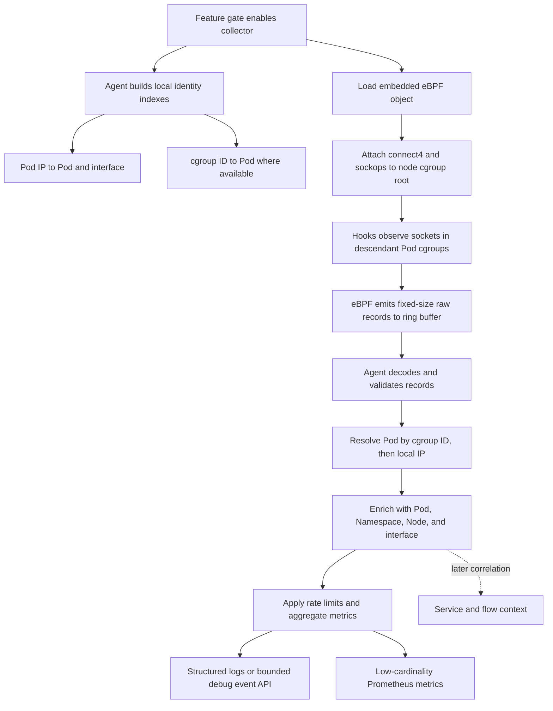

# Antrea eBPF Observability

## PM Requirement to Technical Capability Mapping

| PM requirement | eBPF observation | Deliverable | MVP position |
| --- | --- | --- | --- |
| Socket-level telemetry | `cgroup/connect4` observes an IPv4 TCP connect intent before the connect is executed | Connect-attempt event with Pod, destination, timestamp, cgroup ID, and socket cookie | Include |
| TCP connection lifecycle | `sockops` reports established connections and selected TCP state transitions | Established, state-change, and close events attributed to the local Pod | Include |
| TCP round-trip time | `sockops` exposes smoothed TCP RTT (`srtt_us`) after a connection is established | RTT distribution and per-connection RTT samples | Include |
| Retransmission indicators | `sockops` reports retransmission callbacks and cumulative retransmission count | Retransmission counter and diagnostic event | Include |
| Intermittent TCP failures | Connect intent can be correlated with absence of establishment and terminal TCP states | Timeout-like and failed-establishment symptoms; not always the exact syscall error | Partial; validate first |
| Noisy DNS behavior | A later DNS hook can observe plain UDP/TCP DNS queries and responses | Query rate, repeated queries, response codes, and inferred timeout symptoms | Defer from TCP MVP |
| Service-level retries | Repeated connections to the same destination can be observed | A repeated-connect symptom correlated with a Service when tuple mapping is reliable | Defer; not an L7 retry claim |
| Cross-node latency | TCP RTT measures end-to-end transport RTT from the local Pod socket | Pod-to-remote TCP RTT; remote Pod and Node enrichment when the IP is known | Include this limited meaning |
| Policy-related drops | TCP failure and retransmission symptoms can be correlated with authoritative Antrea data | A combined troubleshooting view only when a reliable policy or flow record exists | Defer correlation work |
| Slow applications | TCP setup time, RTT, retransmission, and connection churn are useful symptoms | Transport-level evidence for investigation | Do not claim application root cause |

### Interpretation

The first release can directly provide useful socket and TCP evidence. 

DNS requires packet or message parsing and a query/response state table. Service retry semantics and policy attribution
require information outside the socket callbacks. They should be separate deliverables, not implied by the TCP MVP.

Cross-node latency in the MVP means the TCP RTT observed by the local socket. It does not isolate latency by source host, tunnel, underlay, destination host, or application. An active two-node probe would be a separate measurement system and is not required for the first release.

## Proposed MVP Result

For a local Linux, `non-hostNetwork`, IPv4 Pod, Antrea can report:

```text
namespace=default pod=client-a node=node-a
event=tcp_retransmit destination=10.10.2.45:8080
srtt_us=42000 total_retrans=3 socket_cookie=...
```

The usable result is not the raw eBPF record. It is an Antrea-enriched observation with a stable consumer contract.

### Event Contract

High-dimensional diagnostic data should be exposed as structured events through logs initially and a bounded debug API or internal event stream when needed:

```text
timestamp
event type
namespace / Pod / Node
local and remote tuple
cgroup ID / socket cookie
TCP state
smoothed RTT
retransmission count
attribution status
```

Events support investigation of a specific Pod or connection. Retention, filtering, and rate limits must be explicit because events can be frequent.

### Metric Contract

Prometheus should expose aggregated operational signals and component health:

```text
antrea_ebpf_events_total{type,attributed}
antrea_ebpf_tcp_srtt_seconds
antrea_ebpf_events_dropped_total{reason}
antrea_ebpf_program_attached{program}
```

Pod name, destination IP, destination port, and socket cookie should not all be metric labels. Those dimensions belong in the event output because they create unbounded Prometheus cardinality.

### Initial Consumers

| Consumer | Consumption model | Initial use |
| --- | --- | --- |
| Platform operator | Agent logs or debug API filtered by Pod | Troubleshoot a connection or slow Pod |
| Prometheus / alerting | Aggregated counters and histograms | Detect elevated retransmission, RTT, or collector failure |
| Future Flow Aggregator integration | Enriched internal event stream | Join transport symptoms with flow records |
| Future UI / NetOps | Query API backed by an event store | Workload-oriented troubleshooting view |

## Implementation Flow



Attaching to the node's parent cgroup is preferred when the kernel cgroup hook applies to descendant
cgroups. It avoids one attachment per container. The agent still maintains cgroup and Pod identity
state for attribution and must validate this behavior for the supported cgroup layouts.

## Component Responsibilities

| Component | Responsibility |
| --- | --- |
| eBPF C programs | Observe kernel callbacks, copy bounded fields, and emit raw records |
| Loader and attachment layer | Load the object, attach programs, report compatibility failures, and clean up |
| Identity resolver | Maintain cgroup ID and IP mappings for local Pods |
| Event processor | Decode, attribute, enrich, rate-limit, and aggregate observations |
| Exporters | Publish metrics and diagnostic events without blocking event ingestion |

## Explicitly Deferred

- IPv6 and Windows support.
- `hostNetwork` Pod attribution.
- DNS query and response tracking.
- Exact `connect(2)` errno for every failure mode.
- L7 retry identification, including HTTP, gRPC, and client-library retries.
- Active cross-node probes or per-path-segment latency attribution.
- Authoritative Service backend or NetworkPolicy decision attribution.
- Persistent event storage, Flow Aggregator integration, and UI integration.

## Architecture Decisions Required

1. Is TCP RTT from the local Pod perspective an acceptable definition of initial cross-node latency?
2. Is a structured debug event interface, plus low-cardinality Prometheus metrics, an acceptable
   first output contract?
3. What kernel, cgroup, BTF, and container-runtime combinations must the MVP support?
4. Is parent-cgroup attachment acceptable after descendant coverage is validated on that matrix?
5. Should exact TCP failure errors be required for MVP, or should failure symptoms be sufficient?
6. Are DNS and higher-level Antrea correlation separate milestones after the TCP MVP?

## Acceptance Criteria for the TCP MVP

- Observe connect, established, TCP state, RTT, and retransmission events for supported local Pods.
- Attribute at least 99 percent of controlled test events to the correct Pod after cache warm-up.
- Demonstrate parent-cgroup coverage for supported cgroup layouts and runtimes.
- Bound maps, ring-buffer memory, event rate, and userspace queues.
- Report program status, processing count, dropped events, and attribution failures.
- Demonstrate no material effect on connection behavior when collection is enabled or unavailable.
- Pass compatibility, restart, Pod churn, load, and failure-injection tests on the agreed matrix.
