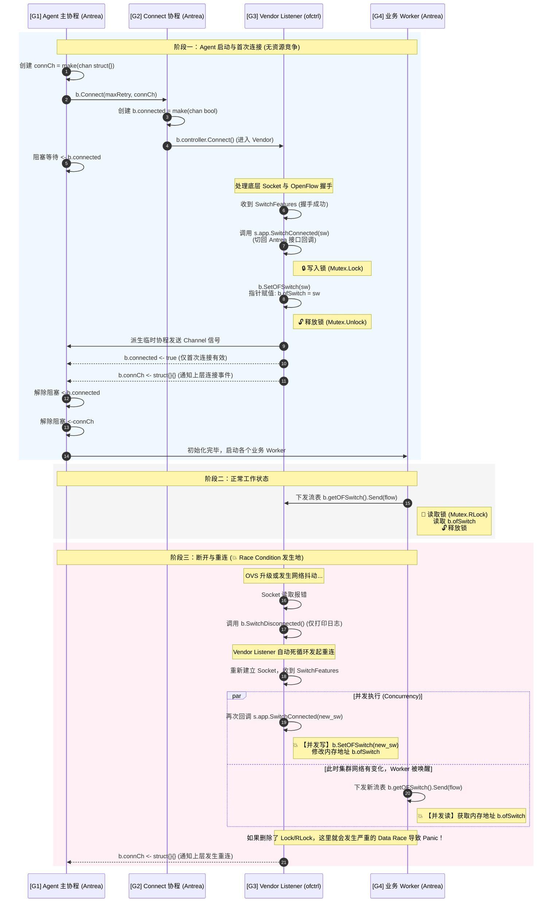

```mermaid
sequenceDiagram
    autonumber
    
    participant G1 as [G1] Agent 主协程 (Antrea)
    participant G2 as [G2] Connect 协程 (Antrea)
    participant G3 as [G3] Vendor Listener (ofctrl)
    participant G4 as [G4] 业务 Worker (Antrea)

    %% ----------------------------------------------------
    rect rgb(240, 248, 255)
    note over G1, G4: 阶段一：Agent 启动与首次连接 (无资源竞争)
    G1->>G1: 创建 connCh = make(chan struct{})
    G1->>G2: b.Connect(maxRetry, connCh)
    G2->>G2: 创建 b.connected = make(chan bool)
    G2->>G3: b.controller.Connect() (进入 Vendor)
    G1->>G1: 阻塞等待 <- b.connected
    
    note over G3: 处理底层 Socket 与 OpenFlow 握手
    G3->>G3: 收到 SwitchFeatures (握手成功)
    G3->>G3: 调用 s.app.SwitchConnected(sw)<br/>(切回 Antrea 接口回调)
    
    note right of G3: 🔒 写入锁 (Mutex.Lock)
    G3->>G3: b.SetOFSwitch(sw) <br/>指针赋值: b.ofSwitch = sw
    note right of G3: 🔓 释放锁 (Mutex.Unlock)
    
    G3->>G1: 派生临时协程发送 Channel 信号
    G3-->>G1: b.connected <- true (仅首次连接有效)
    G3-->>G1: b.connCh <- struct{}{} (通知上层连接事件)
    
    G1->>G1: 解除阻塞 <-b.connected
    G1->>G1: 解除阻塞 <-connCh
    G1->>G4: 初始化完毕，启动各个业务 Worker
    end

    %% ----------------------------------------------------
    rect rgb(245, 245, 245)
    note over G1, G4: 阶段二：正常工作状态
    G4->>G3: 下发流表 b.getOFSwitch().Send(flow)
    note right of G4: 📖 读取锁 (Mutex.RLock)<br/>读取 b.ofSwitch<br/>🔓 释放锁
    end

    %% ----------------------------------------------------
    rect rgb(255, 240, 245)
    note over G1, G4: 阶段三：断开与重连 (💥 Race Condition 发生地)
    note over G3: OVS 升级或发生网络抖动...
    G3->>G3: Socket 读取报错
    G3->>G3: 调用 b.SwitchDisconnected() (仅打印日志)
    
    note over G3: Vendor Listener 自动死循环发起重连
    G3->>G3: 重新建立 Socket，收到 SwitchFeatures
    
    par 并发执行 (Concurrency)
        G3->>G3: 再次回调 s.app.SwitchConnected(new_sw)
        note right of G3: 💥 【并发写】b.SetOFSwitch(new_sw)<br/>修改内存地址 b.ofSwitch
    and 此时集群网络有变化，Worker 被唤醒
        G4->>G4: 下发新流表 b.getOFSwitch().Send(flow)
        note right of G4: 💥 【并发读】获取内存地址 b.ofSwitch
    end
    
    note over G3, G4: 如果删除了 Lock/RLock，这里就会发生严重的 Data Race 导致 Panic！
    
    G3-->>G1: b.connCh <- struct{}{} (通知上层发生重连)
    end
```
